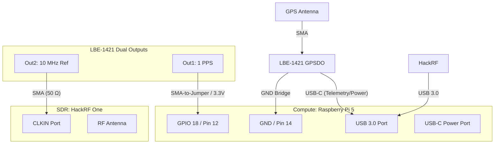

# LBE-1421 GPSDO Wiring Diagram (RF Metrology)

**Revision:** 1.0 (Phase 2A Baseline)
**Hardware:** Leo Bodnar LBE-1421 + HackRF One + Raspberry Pi 5

## 1. Physical Connectivity Diagram



## 2. ASCII Wiring Map

```text
LBE-1421 GPSDO                      Raspberry Pi 5 (GPIO Header)
+-----------------------+           +------------------------------+
| [Out 1]  (1 PPS)      |---------->| [Pin 12] (GPIO 18 / PPS IN)  |
|                       |           |                              |
| [GND]                 |---BRIDGE--| [Pin 14] (Ground)            |
+-----------------------+           +------------------------------+
           |                                       ^
           | (USB-C Cable)                         |
           v                                       |
+-----------------------+           +------------------------------+
| [USB 3.0] <-----------|-----------| [USB 3.0 Port]               |
+-----------------------+           +------------------------------+
HackRF One SDR

+-----------------------+           +-----------------------+
| [CLKIN] <-------------|-----------| [Out 2]  (10 MHz Ref) |
+-----------------------+           +-----------------------+
                                    LBE-1421 (Reference Port)
```

## 3. Critical Wiring Notes

1.  **LBE-1421 Configuration:**
    *   **Out 1:** MUST be set to "1 PPS" mode via Leo Bodnar Config Tool.
    *   **Out 2:** MUST be set to "10,000,000 Hz" mode.
    *   **Drive Strength:** 3.3V CMOS (Native). No level shifter needed for Pi 5 RP1 chip.

2.  **SMA-to-GPIO Adapter:**
    *   Use an SMA-to-DuPont jumper adapter or sacrifice an SMA pigtail.
    *   **Signal (Center):** Connect to GPIO 18 (Physical Pin 12).
    *   **Shield (Outer):** Connect to a Pi 5 Ground pin (e.g., Physical Pin 14).

3.  **Termination:**
    *   The HackRF CLKIN port is high-impedance. For cable runs >30cm, a 50 Ω SMA pass-through terminator at the HackRF end is recommended to ensure clean edges and 1.65V peak voltage.

4.  **Pulse Width:**
    *   The LBE-1421 outputs a **100 ms** pulse for 1 PPS.
    *   Ensure `assert_falling_edge=0` is set in `config.txt` (`dtoverlay=pps-gpio`).
